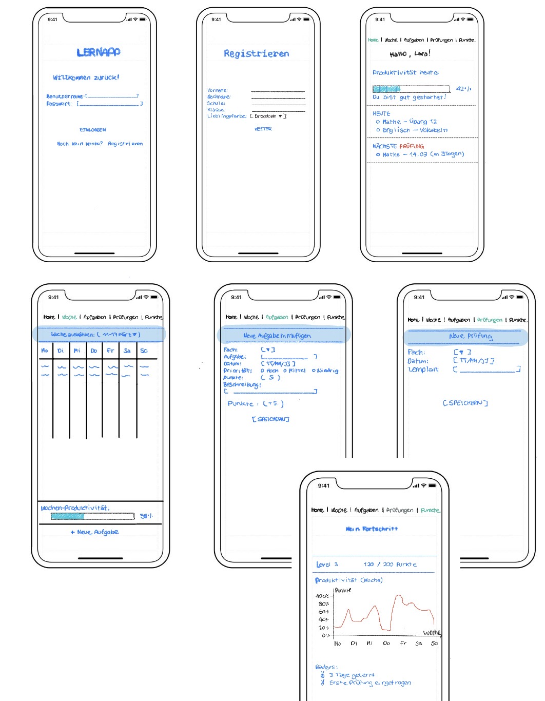

# 📱 Lernapp – Projektbeschreibung

Dieses Projekt wurde im Rahmen des Moduls Informatik II erstellt.  
Ziel war es, eine Lernapplikation zu konzipieren, die Schüler*innen beim Organisieren ihres Schulalltags unterstützt.

---

## 👥 Projektteam & Kontakt

**Teammitglieder:**  
- Kipisha Selvan : *[selvakip@students.zhaw.ch]*  
- Darlene Armenio :  *[armdar01@students.zhaw.ch]*  
- Hannah Jung : *[junghan1@students.zhaw.ch]*
- Mimoza Mehmeti: *[mehmemim@students.zhaw.ch]*

  
**Dozent:**  
- [Wehrli Samuel] :  *[wehs@zhaw.ch]*
- [Ho Ka Men ] : *[hokam001@students.zhaw.ch]*
- [Fox Paul] : *[foxp@zhaw.ch]*

---

##  Projektziel

Das Ziel des Projekts war die Entwicklung eines klar strukturierten, leicht verständlichen App‑Konzepts, das Schüler*innen hilft:

- ihre Aufgaben zu verwalten  
- Prüfungen rechtzeitig zu planen  
- ihre Wochenübersicht im Blick zu behalten  
- ihre Produktivität zu steigern  
- Motivation durch Punkte, Level und Erfolge zu erhalten  

---

## 👤 Persona

Die App basiert auf der Persona **Lara Meier**, einer Schülerin, die:

- schnell den Überblick verliert  
- Motivation durch sichtbare Fortschritte braucht  
- einfache, klare Strukturen bevorzugt  
- wenig Geduld für komplexe Apps hat  

Dokument: `docs/persona.md`

---

##  Hauptfunktionen der App

- Dashboard mit Tagesübersicht  
- Wochenübersicht (Mo–So)  
- Aufgabenverwaltung  
- Prüfungsübersicht  
- Statistik & Produktivität  
- Level‑ und Punktesystem  

Diese Funktionen wurden in mehreren Iterationen verbessert.

---

##  Wireframes (Gesamtübersicht)

Alle Screens wurden in einem einzigen Wireframe‑Bild zusammengeführt.

