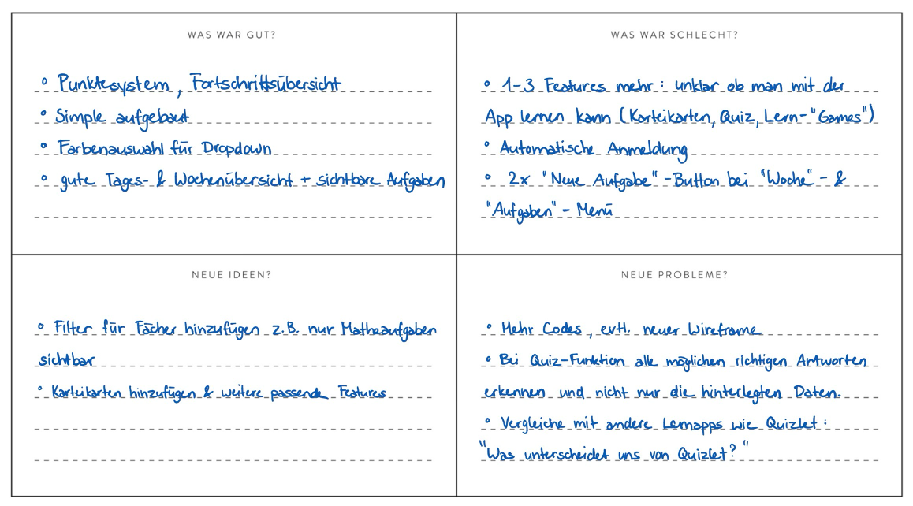

### **1. Hypothesenbildung**

**1.1 Was wissen wir?**

- Die App bietet Funktionen zur Organisation von Aufgaben, Planung von Prüfungen, Wochenübersicht und Fortschrittsanzeige.
- Die Navigation besteht aus den Bereichen Home, Woche, Aufgaben, Prüfungen und Punkte.
- Nutzer:innen sollen Aufgaben und Prüfungen schnell und ohne Aufwand eintragen können.
- Die Buttons „+ Neue Aufgabe“ und „Neue Prüfung hinzufügen“ sind sichtbar platziert.
- Die App soll Stress reduzieren, Übersicht schaffen und Motivation steigern.
- Die App richtet sich an Schüler:innen und Studierende, die ihren Schulalltag besser organisieren möchten und Unterstützung beim Planen von Aufgaben und Prüfungen brauchen.

**1.2 Was wissen wir nicht?**
- Ob neue Nutzer:innen verstehen, welche Schritte sie zuerst ausführen sollen.
- Ob klar erkennbar ist, wie man eine Aufgabe oder eine Prüfung hinzufügt.
- Ob die Bezeichnungen der Buttons eindeutig genug sind (z. B. „+ Neue Aufgabe“, „Neue Prüfung hinzufügen“).
- Ob Nutzer:innen intuitiv verstehen, wie die Navigation aufgebaut ist.
- Ob das Punktesystem und die Produktivitätsanzeige nachvollziehbar sind.

**1.3 Was möchten wir testen?**
- Ob Nutzer:innen ohne Erklärung:
    1. eine Aufgabe hinzufügen können. 
    2. eine Prüfung eintragen können.
    3. die Navigationslogik des Startscreens verstehen.
    4. erkennen, wie die Wochenübersicht funktioniert.
    5. das Punktesystem und die Fortschrittsanzeige interpretieren können

**1.4 Hypothese**
- Neue Nutzer:innen verstehen ohne zusätzliche Erklärung, wie sie auf dem Startscreen eine Aufgabe oder eine Prüfung hinzufügen können.
- Wir erwarten, dass sie innerhalb von 10–15 Sekunden die richtige Funktion   finden, indem sie auf die entsprechende Schaltfläche klicken.

**1.5 Wie bewerten wir den Test?**
- Durchführung eines Wireframe-Tests ohne Erklärung
- Beobachtung der Nutzeraktion
- Messung der Zeit bis zur erfolgreichen Ausführung 
- Erfassung der Anzahl Fehlklicks / Rückfragen
- Reaktion auf Punkte/Level/Produktivität

**1.6 Was ist ein Erfolg?**
- Die Aufgabe oder Prüfung wird selbstständig hinzugefügt
- Zeit < 10 Sekunden
- Maximal 1 Fehlklick
- Keine Rückfragen wie:
    - „Was soll ich jetzt anklicken“
    - „Wo fängt man an“
- Das Punktesystem verstanden wird

### **2. Auswertung : Test-Grid**

